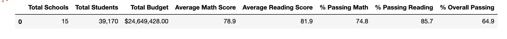
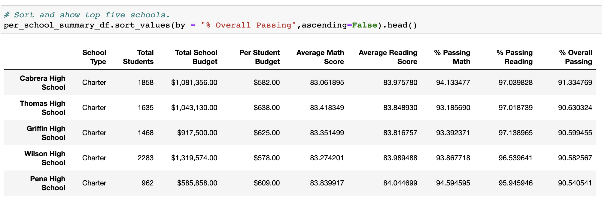
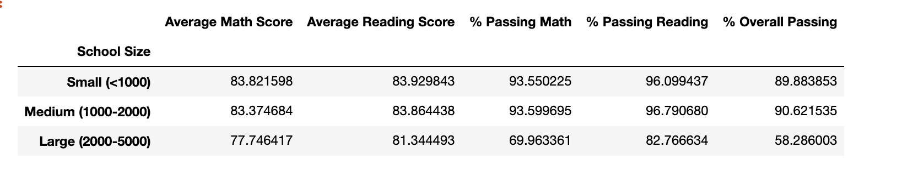

# School_District_Analysis

## Overview of the school district analysis
The purpose of this analysis is to help Maria and her supervisor to collect basic
information of different schools in different districts. It includes information
of different students' school, school district, math score, reading score and so on.
By first collecting these information, we can then calculate the average of math score,
reading score of different schools. By analyzing these information, its useful in
many ways. For example, finding the highest-performing based on the overall
percentage of passing students will help the district determine how much money
should be allocated to and spent on each school. Moreover, we are finishing these
work by using the jupyter notebook with python3, which will also help us to
get more familiar with using the pandas series and data frame by importing data
from the excel.

### Purpose
By doing this analysis, we are able to clearly see the different information of
students scores in different schools.And we can use the results we get to analyze
the education improvement in different districts and schools.

## School_District_Analysis Results

- How is the district summary affected?
  - Because we have made some grades to be null, so the average of math and reading
  - will be affected. So it may have different results during different execution.
- How is the school summary affected?
  - Because we are only collecting information of students in 10 to 12th grade, and students in 9th grade are not included.
  - Therefore, the total student count, Math passing rate, reading passing rate and overall passing rate will be affected.

- How does replacing the ninth graders’ math and reading scores affect Thomas High School’s performance relative to the other schools?
  - the performance of Thomas High School gets better compare to other schools, top 2

- How does replacing the ninth-grade scores affect the following:
  - Math and reading scores by grade
    - It becomes NaN
  - Scores by school spending
    - not affect
  - Scores by school size
  
  
    - not affect
  - Scores by school type
    - affect in little difference

##  Summary (four major changes)
- The THS passing rate for math, and reading
- Average scores of THS in math and reading
- the performance of THS compare to other schools
- THS total student count
